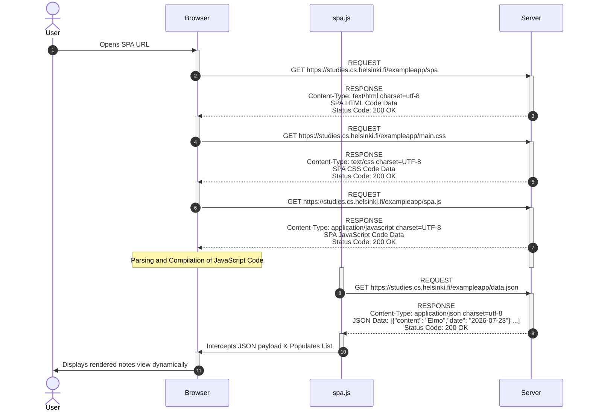

# University of Helsinki - Full Stack Open - Part 0 - Task 0.5

> **Student:** Travis VanDame
>
> **GitHub:** [travis-vandame](https://github.com)
>
> **Part:** 0 (Fundamentals of Web Apps)
>
> **Task:** 0.5 Single Page App (SPA) Loading Flow

This diagram describes the network traffic and browser operations that occur when a user initially opens and loads the Single Page App.

