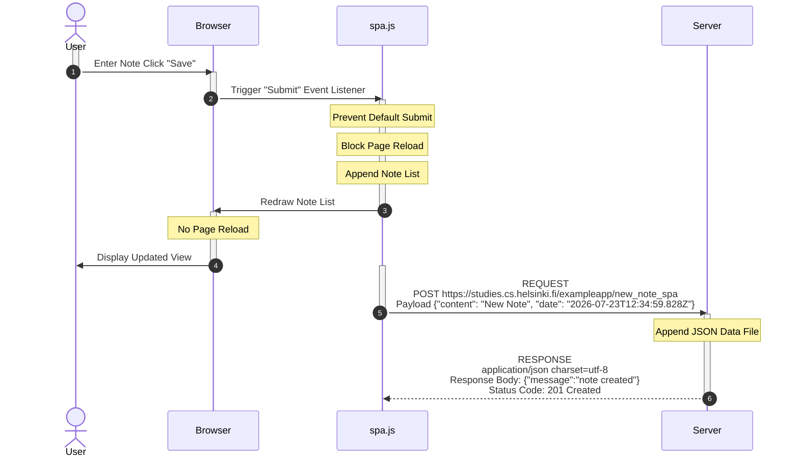

# University of Helsinki - Full Stack Open - Part 0 - Task 0.6

> **Student:** Travis VanDame
>
> **GitHub:** [travis-vandame](https://github.com/travis-vandame)
>
> **Part:** 0 (Fundamentals of Web Apps)
>
> **Task:** 0.6 New Note in Single Page App (SPA) flow

This diagram describes the network traffic and browser operations that occur when a user submits a new note in the Single Page App.

